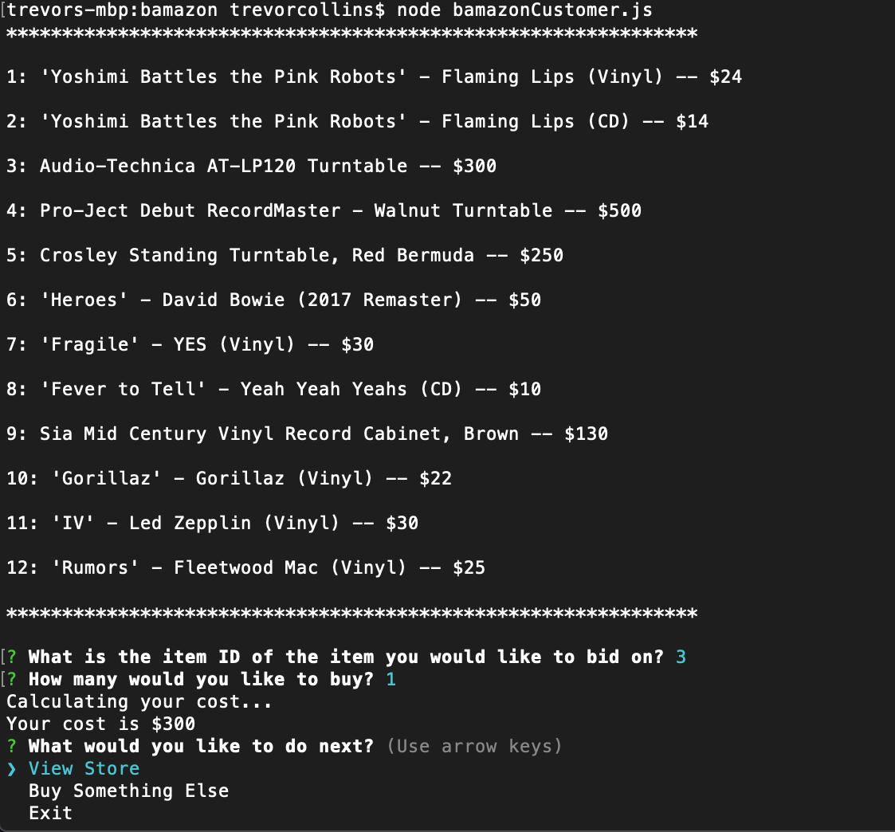
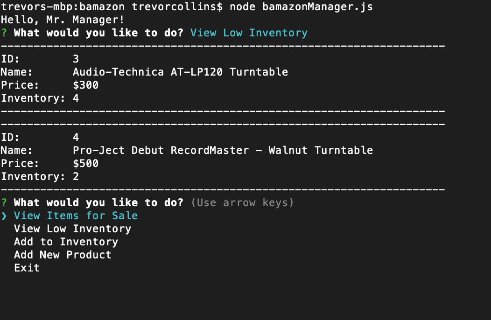

# Bamazon

Bamazon is an Amazon like node application. Customers can buy items from the Bamazon database. Managers can add inventory or items to the database.

## How to use?

Once you've navigated to the bamazon directory in your terminal and installed the 'inquirer' and 'mysql' npm packages, type in "node bamazonCustomer.js" to enter the customer side of the app. Type in "node bamazonMangaer.js" to enter the manager side of the app.

#### Functionality

##### Customer Side

You'll first see all of the items currently in the store. You can then choose the item and quantity you wish to buy. If there isn't enough stock, you'll be asked if you want to buy less. Otherwise, your order will go through, the inventory will be updated, and you'll be asked what you want to do next. You can either view the store, buy another item, or exit the app.

##### Manager Side

You will be presented with a list of options.

* View Items for Sale
  You will see a list of all items currently in the Bamazon database.

* View Low Inventory
  You will see a list of all items currently in the Bamazon database with less than 5 in their inventory.

* Add to Inventory
  You will see a list of the items and their inventory. You will be prompted for the ID of the item you would like to add to and how many you would like to add.

* Add New Product
  You will give a name, price, department, and quantity of an item you wish to add to the database.
  

## NPMs Used

* mysql
* Inquirer

## Videos

Here is a link to a video demo of the bamazonCustomer.js app:
[Video Demo](https://youtu.be/p0Ax_tnOBqA)

Here is a link to a video demo of the bamazonManager.js app:
[Video Demo](https://youtu.be/0Kz7qRyciEU)
